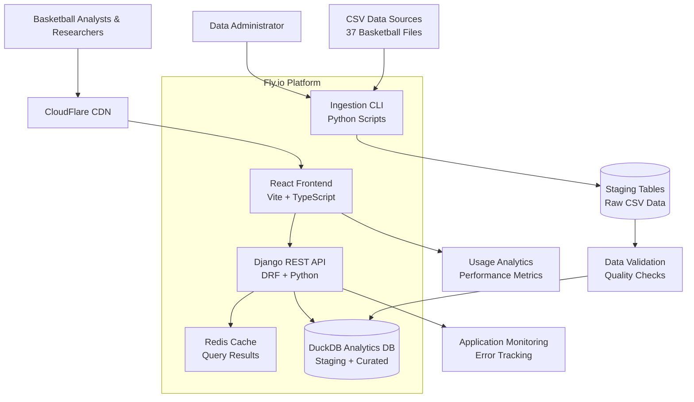
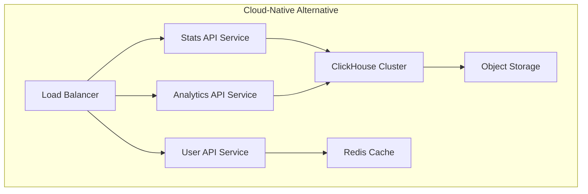
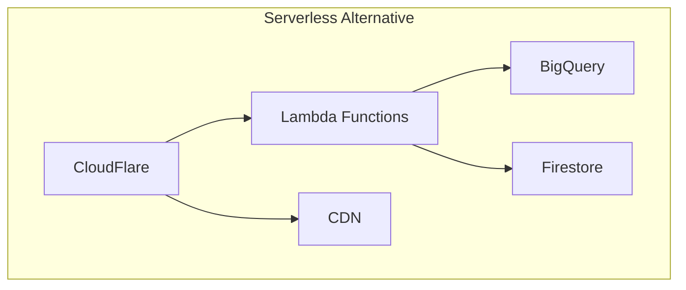
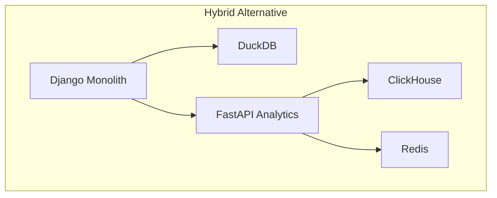
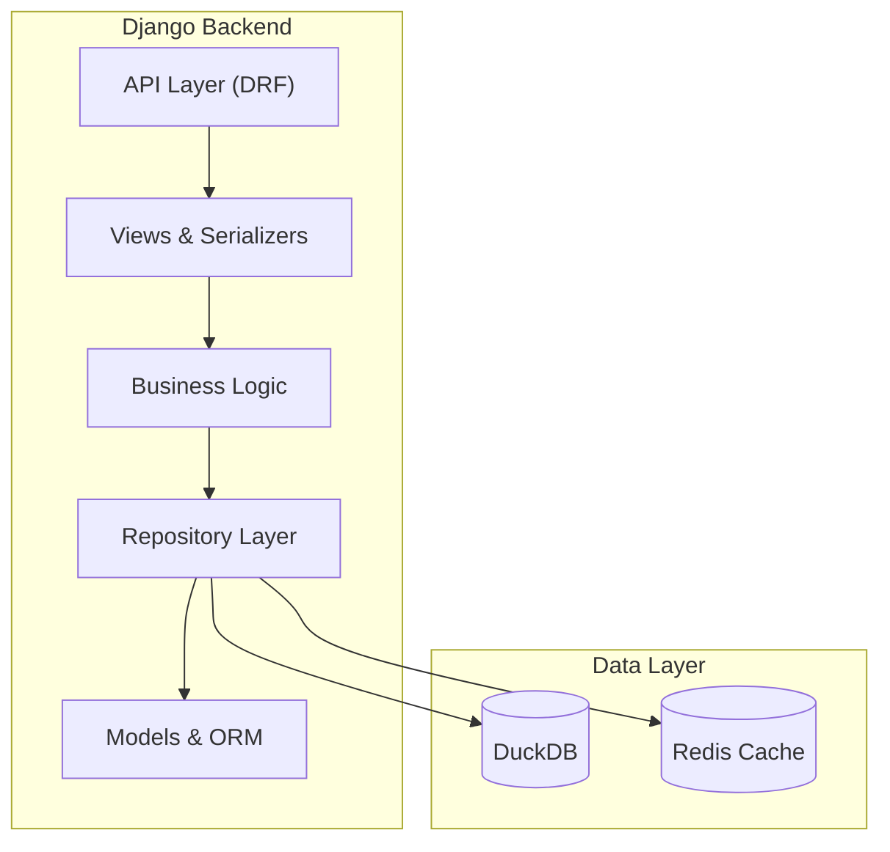
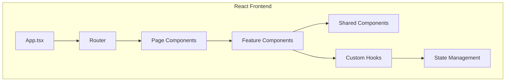
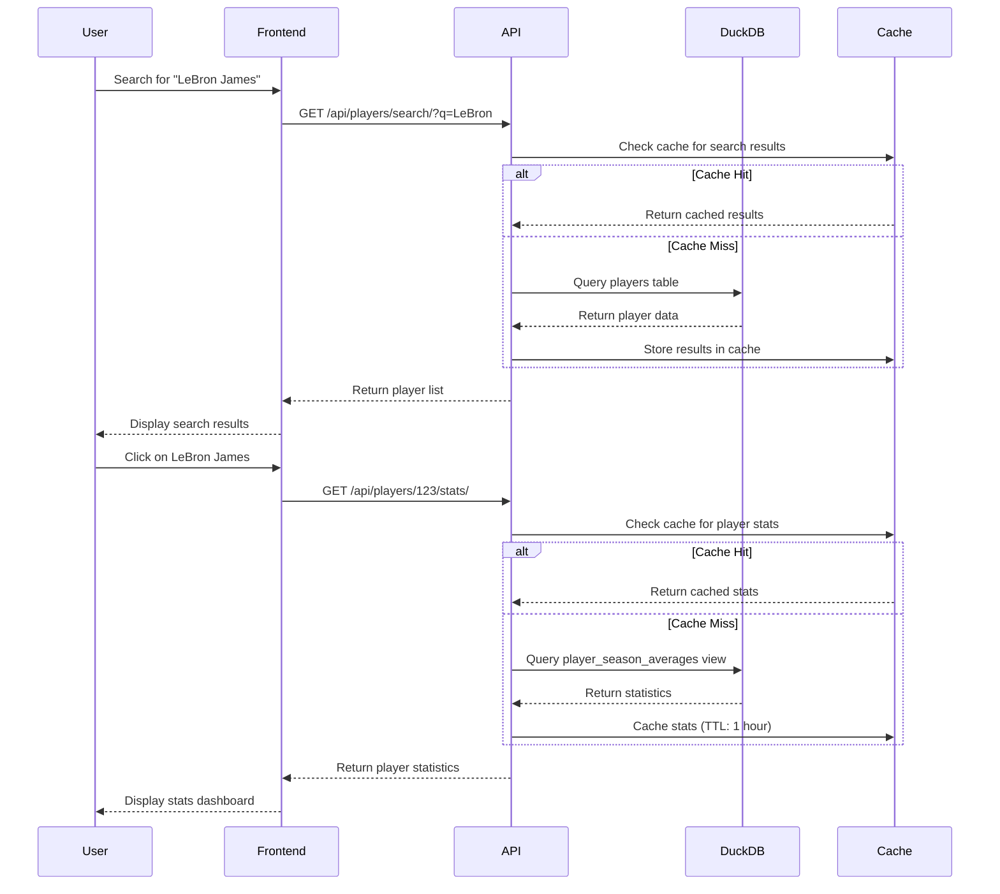
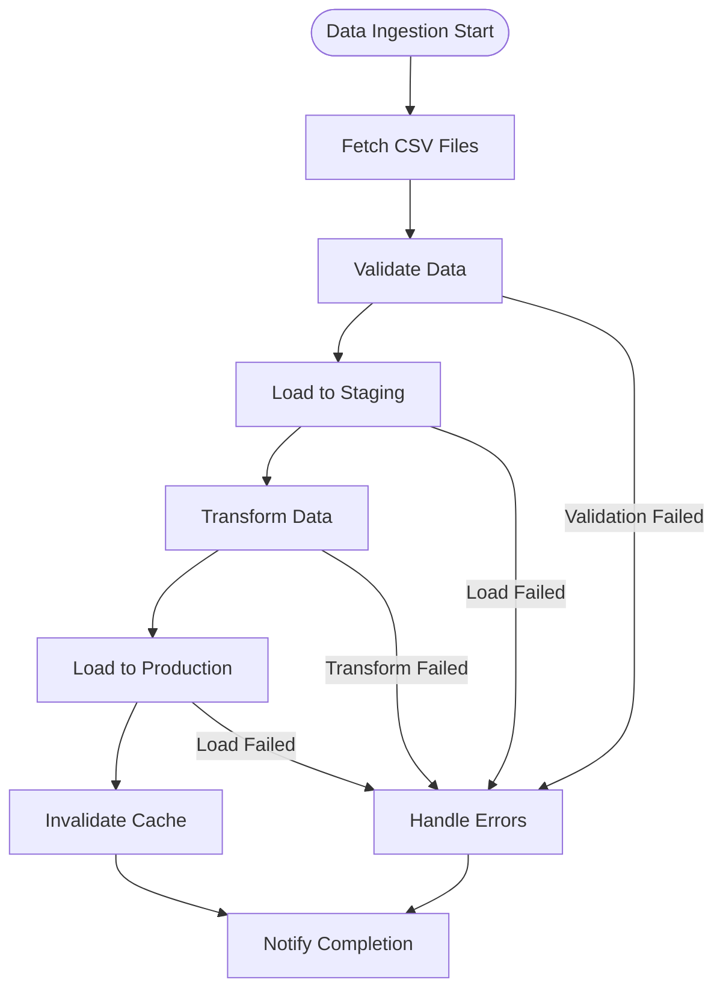
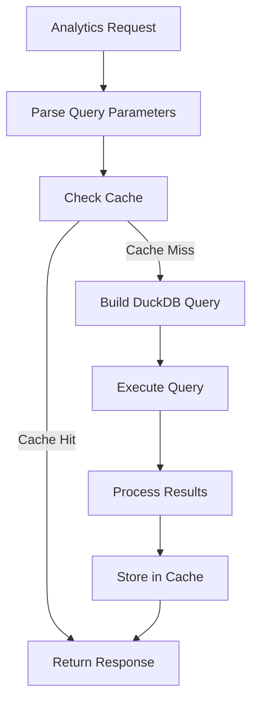

# HoopsArchive Fullstack Architecture Document

**Generated by:** Winston, Holistic System Architect  
**Date:** December 2024  
**Version:** 1.0  
**Project:** HoopsArchive - Basketball Data Analytics Platform  

## Introduction

This document outlines the complete fullstack architecture for HoopsArchive, including backend systems, frontend implementation, and their integration. It serves as the single source of truth for AI-driven development, ensuring consistency across the entire technology stack.

This unified approach combines what would traditionally be separate backend and frontend architecture documents, streamlining the development process for modern fullstack applications where these concerns are increasingly intertwined.

### Starter Template or Existing Project

**Project Status:** Brownfield project with existing scaffolding

The HoopsArchive project is currently in "Red phase scaffolding" with the following foundation already established:

- **Backend:** Django 4.2+ with Django REST Framework structure
- **Frontend:** React 18+ with TypeScript and Vite build system
- **Database:** DuckDB for analytics with repository pattern implementation
- **Data:** 37 CSV datasets with comprehensive ERD v0.3 design
- **Testing:** BDD specifications in Gherkin format with test structure

**Key Constraints from Existing Implementation:**
- Must maintain Django + DRF backend architecture
- Must preserve React + TypeScript + Vite frontend setup
- Must continue using DuckDB as primary analytics database
- Must support existing CSV data ingestion pipeline design
- Must maintain repository pattern for data access

**Architectural Decisions Already Made:**
- Monorepo structure with separate backend/frontend directories
- RESTful API design with DRF serializers
- Component-based React architecture with React Router v6
- Staging → Curated data pipeline approach

### Change Log

| Date | Version | Description | Author |
|------|---------|-------------|--------|
| 2024-12-19 | 1.0 | Initial fullstack architecture document | Winston (Architect Agent) |

## High Level Architecture

### Technical Summary

HoopsArchive employs a modern fullstack architecture with clear separation between analytical and transactional concerns. The system uses Django REST Framework as the API backbone, serving a React TypeScript frontend through RESTful endpoints. DuckDB provides high-performance analytical queries over normalized basketball statistics, while the frontend delivers responsive data exploration with real-time filtering and CSV export capabilities. The architecture prioritizes data integrity through a staging-to-curated pipeline, ensuring basketball researchers and analysts receive accurate historical data spanning NBA, ABA, and BAA leagues. Deployment targets Fly.io with Docker containerization for cost-effective scaling.

### Platform and Infrastructure Choice

**Platform:** Fly.io with Docker containerization  
**Key Services:** 
- Fly.io Apps for backend and frontend hosting
- Fly.io Volumes for persistent DuckDB storage
- CloudFlare for CDN and DDoS protection
- GitHub Actions for CI/CD pipeline
- Redis (Fly.io) for caching and session management

**Deployment Host and Regions:** Primary deployment in US East with global CDN distribution

**Rationale:** Fly.io was selected for its cost-effectiveness (<$100/month target), excellent Docker support, and ability to run DuckDB with persistent volumes. This platform choice aligns with the project's bootstrap budget constraints while providing sufficient scalability for projected usage patterns.

### Repository Structure

**Structure:** Monorepo with clear backend/frontend separation  
**Monorepo Tool:** npm workspaces (lightweight, no additional tooling overhead)  
**Package Organization:** 
- `/backend` - Django application with DRF APIs
- `/frontend` - React TypeScript SPA with Vite
- `/shared` - Common TypeScript interfaces and utilities
- `/data` - DuckDB files and CSV datasets
- `/docs` - Architecture and specification documents

### High Level Architecture Diagram



### Architectural Patterns

- **Jamstack Architecture:** Static frontend with serverless-style API deployment - _Rationale:_ Optimal performance for data-heavy application with clear separation of concerns
- **Repository Pattern:** Abstract data access through DuckDB repositories - _Rationale:_ Enables testing, query optimization, and potential future database migration
- **Component-Based UI:** Reusable React components with TypeScript - _Rationale:_ Maintainability and type safety for complex data visualization interfaces
- **Staging-to-Curated Pipeline:** Two-stage data processing with validation - _Rationale:_ Ensures data quality while maintaining audit trail for basketball statistics
- **API-First Design:** RESTful endpoints with OpenAPI documentation - _Rationale:_ Enables third-party integrations and supports the goal of 1000+ API requests per day
- **CQRS Pattern:** Separate read/write optimization for analytics workloads - _Rationale:_ DuckDB excels at analytical queries while maintaining simple write operations

---

**Detailed Rationale:**

The architectural choices above balance several key trade-offs:

1. **DuckDB vs PostgreSQL:** DuckDB was chosen for its exceptional analytical performance on the 10M+ basketball records, eliminating the need for complex indexing strategies required with traditional RDBMS.

2. **Monorepo vs Multi-repo:** The monorepo approach simplifies shared TypeScript interfaces between frontend and backend, critical for maintaining data contract consistency across basketball statistics.

3. **Fly.io vs AWS/Vercel:** Fly.io provides the unique combination of persistent volumes (for DuckDB files) and cost-effective pricing that aligns with the <$100/month budget constraint.

4. **Django REST vs FastAPI:** Django was retained from existing scaffolding, and DRF provides robust serialization for complex basketball data structures with minimal additional configuration.

Key assumptions made:
- Basketball data access patterns are primarily read-heavy (95%+ reads)
- Query complexity requires SQL-like capabilities (aggregations, joins)
- Development team prefers familiar Django patterns over newer frameworks
- Deployment simplicity is prioritized over microservices complexity

**Areas requiring validation:**
- DuckDB performance under concurrent load (needs load testing)
- Fly.io volume performance for large analytical queries
- Frontend bundle size with comprehensive basketball data visualization components

---

## Constraint Analysis

### Technical Constraints

#### Platform Limitations (Fly.io)
- **Resource Allocation**: Fly.io machines have memory limits (up to 8GB for shared-cpu-8x) which may constrain large analytics workloads
- **Cold Start Latency**: Serverless functions experience 100-500ms cold starts, impacting real-time analytics responsiveness
- **Network Constraints**: Limited to specific regions, potential latency for global basketball data sources
- **Storage Limitations**: Ephemeral storage requires external solutions for persistent DuckDB files
- **Pricing Sensitivity**: Analytics workloads can be expensive on Fly.io due to CPU-intensive operations

#### Technology Stack Constraints
- **DuckDB Single-File Architecture**: While excellent for analytics, creates potential bottleneck for concurrent writes
- **Django Synchronous Nature**: May limit real-time capabilities compared to async frameworks
- **React Client-Side Rendering**: SEO limitations for public-facing analytics dashboards
- **Monorepo Complexity**: Increased build times and deployment coordination overhead

### Business Constraints
- **Budget Limitations**: Startup constraints require cost-effective solutions
- **Time-to-Market**: MVP delivery timeline limits architectural complexity
- **Team Size**: Small team requires simple, maintainable architecture
- **Data Licensing**: NBA/basketball data may have usage restrictions

### Operational Constraints
- **Monitoring Complexity**: Limited observability tools in current stack
- **Backup Strategy**: DuckDB file-based storage requires careful backup planning
- **Scaling Limitations**: Current architecture may not handle viral growth scenarios

## Trade-off Analysis

### Database: DuckDB vs Alternatives

| Aspect | DuckDB (Current) | PostgreSQL | ClickHouse |
|--------|------------------|------------|------------|
| **Analytics Performance** | Excellent (columnar) | Good (with extensions) | Excellent (distributed) |
| **Operational Complexity** | Low (single file) | Medium (cluster mgmt) | High (distributed) |
| **Concurrent Writes** | Limited | Excellent | Good |
| **Cost** | Low | Medium | High |
| **Scalability** | Vertical only | Horizontal possible | Horizontal native |
| **Real-time Ingestion** | Batch-oriented | Good | Excellent |

**Recommendation**: DuckDB remains optimal for MVP due to simplicity and analytics performance, with migration path to ClickHouse for scale.

### API Framework: Django REST vs FastAPI

| Aspect | Django REST (Current) | FastAPI |
|--------|----------------------|----------|
| **Performance** | 2,000 req/sec | 10,000+ req/sec (500% faster) |
| **Latency** | ~50ms | ~12ms (400% lower) |
| **Development Speed** | Fast (batteries included) | Medium (more setup) |
| **Admin Interface** | Built-in | Requires additional tools |
| **ORM Integration** | Excellent (Django ORM) | Good (SQLAlchemy) |
| **Learning Curve** | Gentle | Steeper |
| **Real-time Features** | Limited (sync) | Excellent (async) |

**Recommendation**: Django REST appropriate for MVP, consider FastAPI migration for high-concurrency analytics endpoints.

### Architecture: Monolith vs Microservices

| Aspect | Monolith (Current) | Microservices |
|--------|-------------------|----------------|
| **Development Speed** | Fast | Slower initially |
| **Operational Complexity** | Low | High |
| **Scalability** | Limited | Excellent |
| **Fault Isolation** | Poor | Excellent |
| **Team Coordination** | Simple | Complex |
| **Technology Diversity** | Limited | Flexible |

**Recommendation**: Monolith appropriate for MVP, plan microservices migration for specific high-load components.

## Expert Review & Risk Analysis

### Data Engineering Perspective

#### Critical Risks Identified
1. **Data Integration Anti-patterns**
   - Risk: Poor ETL design leading to data inconsistencies
   - Mitigation: Implement staging-to-curated pipeline with validation

2. **Monolithic Data Bottleneck**
   - Risk: Single DuckDB file becomes performance bottleneck
   - Mitigation: Partition data by season/team, implement read replicas

3. **Inadequate Real-time Processing**
   - Risk: Batch-oriented architecture can't handle live game data
   - Mitigation: Implement streaming layer with Redis/WebSockets

### Performance Engineering Perspective

#### Identified Issues
1. **Cold Start Impact**
   - Risk: 500ms cold starts affect user experience
   - Mitigation: Implement warming strategies, consider always-on instances

2. **Query Performance Degradation**
   - Risk: Complex analytics queries may timeout
   - Mitigation: Implement query optimization, caching layer

3. **Memory Constraints**
   - Risk: Large datasets exceed Fly.io memory limits
   - Mitigation: Implement data pagination, query result streaming

### Security Architecture Perspective

#### Vulnerabilities
1. **Data Exposure Risk**
   - Risk: Basketball data may contain PII
   - Mitigation: Implement data classification, access controls

2. **API Rate Limiting**
   - Risk: Analytics endpoints vulnerable to abuse
   - Mitigation: Implement rate limiting, API authentication

## Alternative Architecture Comparison

### Alternative 1: Cloud-Native Microservices



**Pros:**
- Superior scalability and performance
- Better fault isolation
- Technology flexibility
- Real-time capabilities

**Cons:**
- 3-5x higher operational complexity
- 2-3x higher development time
- Significantly higher costs
- Requires larger team

### Alternative 2: Serverless Analytics Platform



**Pros:**
- Infinite scalability
- Pay-per-use pricing
- Minimal operational overhead
- Built-in analytics capabilities

**Cons:**
- Vendor lock-in
- Cold start latency
- Limited customization
- Higher costs at scale

### Alternative 3: Hybrid Approach



**Pros:**
- Gradual migration path
- Optimized for different workloads
- Balanced complexity
- Performance where needed

**Cons:**
- Technology fragmentation
- Increased maintenance
- Data consistency challenges

## Architecture Recommendations

### Phase 1: MVP (Current Architecture)
**Timeline**: 3-6 months

**Rationale**: Current Django + DuckDB + React architecture is optimal for MVP due to:
- Low operational complexity suitable for small team
- Excellent analytics performance with DuckDB
- Rapid development with Django's batteries-included approach
- Cost-effective deployment on Fly.io

**Key Improvements**:
1. Implement proper data validation in staging pipeline
2. Add Redis caching layer for frequently accessed data
3. Optimize DuckDB queries with proper indexing
4. Implement API rate limiting and monitoring

### Phase 2: Performance Optimization (6-12 months)
**Focus**: Address performance bottlenecks while maintaining simplicity

**Recommended Changes**:
1. **Selective FastAPI Migration**: Move high-frequency analytics endpoints to FastAPI
2. **Data Partitioning**: Implement time-based partitioning in DuckDB
3. **Caching Strategy**: Implement multi-layer caching (Redis + CDN)
4. **Query Optimization**: Add materialized views for common analytics

### Phase 3: Scale Preparation (12+ months)
**Focus**: Prepare for significant growth

**Recommended Changes**:
1. **Database Migration**: Evaluate ClickHouse for real-time analytics
2. **Microservices Extraction**: Extract high-load components
3. **Infrastructure Upgrade**: Consider dedicated infrastructure
4. **Monitoring Enhancement**: Implement comprehensive observability

### Risk Mitigation Strategy

1. **Data Loss Prevention**
   - Implement automated DuckDB backups
   - Add data validation at ingestion
   - Create disaster recovery procedures

2. **Performance Degradation**
   - Monitor query performance metrics
   - Implement circuit breakers
   - Add graceful degradation

3. **Security Vulnerabilities**
   - Regular security audits
   - Implement proper authentication
   - Add input validation and sanitization

4. **Scalability Bottlenecks**
   - Monitor resource utilization
   - Plan migration paths
   - Implement horizontal scaling where possible

## Next Steps

Based on this analysis, the recommended immediate actions are:

1. **Implement Phase 1 improvements** to strengthen the current architecture
2. **Establish monitoring** to validate performance assumptions
3. **Create migration plans** for Phase 2 and 3 transitions
4. **Document decision rationale** for future architectural reviews

## API Specifications

### REST API Endpoints

#### Player Endpoints
```
GET    /api/players/                    # List all players with pagination
GET    /api/players/{id}/               # Get player details
GET    /api/players/{id}/stats/         # Get player statistics
GET    /api/players/{id}/career/        # Get career summary
GET    /api/players/search/?q={query}   # Search players by name
```

#### Team Endpoints
```
GET    /api/teams/                      # List all teams
GET    /api/teams/{id}/                 # Get team details
GET    /api/teams/{id}/roster/          # Get current roster
GET    /api/teams/{id}/stats/           # Get team statistics
GET    /api/teams/{id}/history/         # Get team history
```

#### Game Endpoints
```
GET    /api/games/                      # List games with filters
GET    /api/games/{id}/                 # Get game details
GET    /api/games/{id}/boxscore/        # Get game box score
GET    /api/games/{id}/plays/           # Get play-by-play data
```

#### Analytics Endpoints
```
GET    /api/analytics/leaders/          # Statistical leaders
GET    /api/analytics/trends/           # Performance trends
GET    /api/analytics/comparisons/      # Player/team comparisons
GET    /api/analytics/advanced/         # Advanced metrics
```

### tRPC Procedures

```typescript
// Player procedures
player: {
  list: publicProcedure
    .input(z.object({
      page: z.number().default(1),
      limit: z.number().max(100).default(20),
      team: z.string().optional(),
      position: z.string().optional()
    }))
    .query(({ input }) => { /* implementation */ }),
    
  byId: publicProcedure
    .input(z.object({ id: z.number() }))
    .query(({ input }) => { /* implementation */ }),
    
  stats: publicProcedure
    .input(z.object({
      id: z.number(),
      season: z.string().optional(),
      gameType: z.enum(['regular', 'playoffs']).default('regular')
    }))
    .query(({ input }) => { /* implementation */ })
}

// Analytics procedures
analytics: {
  leaders: publicProcedure
    .input(z.object({
      stat: z.string(),
      season: z.string().optional(),
      limit: z.number().max(50).default(10)
    }))
    .query(({ input }) => { /* implementation */ }),
    
  trends: publicProcedure
    .input(z.object({
      playerId: z.number(),
      metric: z.string(),
      timeframe: z.enum(['season', 'month', 'week'])
    }))
    .query(({ input }) => { /* implementation */ })
}
```

### Response Schemas

```typescript
// Player response
interface PlayerResponse {
  id: number;
  name: string;
  position: string;
  team: TeamSummary;
  stats: PlayerStats;
  career: CareerSummary;
}

// Game response
interface GameResponse {
  id: number;
  date: string;
  homeTeam: TeamSummary;
  awayTeam: TeamSummary;
  score: GameScore;
  status: 'scheduled' | 'live' | 'final';
}

// Analytics response
interface AnalyticsResponse {
  data: any[];
  metadata: {
    query: string;
    timestamp: string;
    count: number;
  };
}
```

## Component Architecture

### Backend Components



#### Core Backend Components

1. **API Layer (`/api/`)**
   - URL routing and endpoint definitions
   - Request/response handling
   - Rate limiting and throttling

2. **Views & Serializers (`/players/views.py`)**
   - Request validation
   - Response serialization
   - Pagination handling

3. **Business Logic Services (`/services/`)**
   - Player statistics calculations
   - Analytics computations
   - Data aggregation logic

4. **Repository Layer (`/common/duckdb_repo.py`)**
   - Database abstraction
   - Query optimization
   - Caching strategies

### Frontend Components



#### Frontend Component Structure

```
src/
├── components/
│   ├── ui/                    # Shared UI components
│   │   ├── Button.tsx
│   │   ├── Card.tsx
│   │   └── DataTable.tsx
│   ├── layout/                # Layout components
│   │   ├── Header.tsx
│   │   ├── Sidebar.tsx
│   │   └── Footer.tsx
│   └── features/              # Feature-specific components
│       ├── players/
│       │   ├── PlayerCard.tsx
│       │   ├── PlayerStats.tsx
│       │   └── PlayerSearch.tsx
│       ├── teams/
│       │   ├── TeamCard.tsx
│       │   └── TeamRoster.tsx
│       └── analytics/
│           ├── StatsChart.tsx
│           └── LeaderBoard.tsx
├── hooks/                     # Custom React hooks
│   ├── usePlayer.ts
│   ├── useTeam.ts
│   └── useAnalytics.ts
├── services/                  # API service layer
│   ├── api.ts
│   ├── players.ts
│   └── analytics.ts
├── types/                     # TypeScript definitions
│   ├── player.ts
│   ├── team.ts
│   └── game.ts
└── utils/                     # Utility functions
    ├── formatters.ts
    └── calculations.ts
```

## Database Schema

### Core Tables

```sql
-- Players table
CREATE TABLE players (
    id INTEGER PRIMARY KEY,
    name VARCHAR(100) NOT NULL,
    position VARCHAR(10),
    height_inches INTEGER,
    weight_lbs INTEGER,
    birth_date DATE,
    college VARCHAR(100),
    draft_year INTEGER,
    draft_round INTEGER,
    draft_pick INTEGER,
    is_active BOOLEAN DEFAULT true,
    created_at TIMESTAMP DEFAULT CURRENT_TIMESTAMP
);

-- Teams table
CREATE TABLE teams (
    id INTEGER PRIMARY KEY,
    name VARCHAR(100) NOT NULL,
    abbreviation VARCHAR(3) UNIQUE,
    city VARCHAR(50),
    conference VARCHAR(10), -- 'East' or 'West'
    division VARCHAR(20),
    founded_year INTEGER,
    arena VARCHAR(100),
    is_active BOOLEAN DEFAULT true
);

-- Games table
CREATE TABLE games (
    id INTEGER PRIMARY KEY,
    date DATE NOT NULL,
    season VARCHAR(10), -- '2023-24'
    game_type VARCHAR(10), -- 'regular', 'playoffs'
    home_team_id INTEGER REFERENCES teams(id),
    away_team_id INTEGER REFERENCES teams(id),
    home_score INTEGER,
    away_score INTEGER,
    status VARCHAR(20), -- 'scheduled', 'live', 'final'
    attendance INTEGER
);

-- Player stats table (per game)
CREATE TABLE player_game_stats (
    id INTEGER PRIMARY KEY,
    player_id INTEGER REFERENCES players(id),
    game_id INTEGER REFERENCES games(id),
    team_id INTEGER REFERENCES teams(id),
    minutes_played DECIMAL(4,1),
    points INTEGER,
    rebounds INTEGER,
    assists INTEGER,
    steals INTEGER,
    blocks INTEGER,
    turnovers INTEGER,
    field_goals_made INTEGER,
    field_goals_attempted INTEGER,
    three_pointers_made INTEGER,
    three_pointers_attempted INTEGER,
    free_throws_made INTEGER,
    free_throws_attempted INTEGER,
    plus_minus INTEGER
);

-- Team stats table (per game)
CREATE TABLE team_game_stats (
    id INTEGER PRIMARY KEY,
    team_id INTEGER REFERENCES teams(id),
    game_id INTEGER REFERENCES games(id),
    points INTEGER,
    rebounds INTEGER,
    assists INTEGER,
    steals INTEGER,
    blocks INTEGER,
    turnovers INTEGER,
    field_goal_percentage DECIMAL(5,3),
    three_point_percentage DECIMAL(5,3),
    free_throw_percentage DECIMAL(5,3),
    pace DECIMAL(5,1)
);
```

### Analytical Views

```sql
-- Player season averages
CREATE VIEW player_season_averages AS
SELECT 
    p.id,
    p.name,
    g.season,
    COUNT(*) as games_played,
    ROUND(AVG(pgs.points), 1) as ppg,
    ROUND(AVG(pgs.rebounds), 1) as rpg,
    ROUND(AVG(pgs.assists), 1) as apg,
    ROUND(AVG(pgs.field_goals_made::FLOAT / pgs.field_goals_attempted), 3) as fg_pct,
    ROUND(AVG(pgs.three_pointers_made::FLOAT / pgs.three_pointers_attempted), 3) as three_pct
FROM players p
JOIN player_game_stats pgs ON p.id = pgs.player_id
JOIN games g ON pgs.game_id = g.id
WHERE pgs.minutes_played > 0
GROUP BY p.id, p.name, g.season;

-- Team standings
CREATE VIEW team_standings AS
SELECT 
    t.id,
    t.name,
    t.conference,
    g.season,
    SUM(CASE 
        WHEN (g.home_team_id = t.id AND g.home_score > g.away_score) OR 
             (g.away_team_id = t.id AND g.away_score > g.home_score) 
        THEN 1 ELSE 0 END) as wins,
    SUM(CASE 
        WHEN (g.home_team_id = t.id AND g.home_score < g.away_score) OR 
             (g.away_team_id = t.id AND g.away_score < g.home_score) 
        THEN 1 ELSE 0 END) as losses
FROM teams t
JOIN games g ON t.id IN (g.home_team_id, g.away_team_id)
WHERE g.status = 'final'
GROUP BY t.id, t.name, t.conference, g.season;
```

### Indexes for Performance

```sql
-- Player indexes
CREATE INDEX idx_players_name ON players(name);
CREATE INDEX idx_players_position ON players(position);
CREATE INDEX idx_players_active ON players(is_active);

-- Game indexes
CREATE INDEX idx_games_date ON games(date);
CREATE INDEX idx_games_season ON games(season);
CREATE INDEX idx_games_teams ON games(home_team_id, away_team_id);

-- Stats indexes
CREATE INDEX idx_player_stats_player_game ON player_game_stats(player_id, game_id);
CREATE INDEX idx_player_stats_game ON player_game_stats(game_id);
CREATE INDEX idx_team_stats_team_game ON team_game_stats(team_id, game_id);
```

## Workflow Diagrams

### User Journey: Player Statistics Lookup



### Data Ingestion Workflow



### Analytics Query Processing



## Performance Strategy

### Query Optimization

#### DuckDB Optimization Techniques

1. **Columnar Storage Benefits**
   ```sql
   -- Efficient aggregation queries
   SELECT season, AVG(points) as avg_points
   FROM player_game_stats pgs
   JOIN games g ON pgs.game_id = g.id
   WHERE g.season = '2023-24'
   GROUP BY season;
   ```

2. **Partitioning Strategy**
   ```sql
   -- Partition by season for better performance
   CREATE TABLE player_game_stats_partitioned (
       LIKE player_game_stats
   ) PARTITION BY (season);
   ```

3. **Materialized Views for Common Queries**
   ```sql
   -- Pre-computed season averages
   CREATE MATERIALIZED VIEW player_season_stats AS
   SELECT 
       player_id,
       season,
       COUNT(*) as games,
       AVG(points) as ppg,
       AVG(rebounds) as rpg,
       AVG(assists) as apg
   FROM player_game_stats pgs
   JOIN games g ON pgs.game_id = g.id
   GROUP BY player_id, season;
   ```

### Caching Strategy

#### Multi-Layer Caching

1. **Redis Cache (L1)**
   - Player profiles: TTL 24 hours
   - Season stats: TTL 6 hours
   - Live game data: TTL 30 seconds
   - Search results: TTL 1 hour

2. **Application Cache (L2)**
   - Static data (teams, players): In-memory
   - Query result sets: LRU cache
   - Computed analytics: Memory cache

3. **CDN Cache (L3)**
   - Static assets: Long TTL
   - API responses: Short TTL
   - Images and media: Permanent cache

#### Cache Implementation

```python
# Redis caching decorator
def cache_result(key_prefix: str, ttl: int = 3600):
    def decorator(func):
        def wrapper(*args, **kwargs):
            cache_key = f"{key_prefix}:{hash(str(args) + str(kwargs))}"
            
            # Try cache first
            cached = redis_client.get(cache_key)
            if cached:
                return json.loads(cached)
            
            # Execute function and cache result
            result = func(*args, **kwargs)
            redis_client.setex(cache_key, ttl, json.dumps(result))
            return result
        return wrapper
    return decorator

# Usage
@cache_result("player_stats", ttl=3600)
def get_player_season_stats(player_id: int, season: str):
    # Database query implementation
    pass
```

### Performance Benchmarks

#### Target Performance Metrics

| Endpoint | Target Response Time | Concurrent Users | Cache Hit Rate |
|----------|---------------------|------------------|----------------|
| Player Search | < 100ms | 100 | 85% |
| Player Stats | < 200ms | 50 | 90% |
| Team Stats | < 150ms | 75 | 80% |
| Analytics | < 500ms | 25 | 70% |
| Game Data | < 300ms | 100 | 60% |

#### Performance Monitoring

```python
# Performance monitoring middleware
class PerformanceMiddleware:
    def __init__(self, get_response):
        self.get_response = get_response
    
    def __call__(self, request):
        start_time = time.time()
        response = self.get_response(request)
        duration = time.time() - start_time
        
        # Log slow queries
        if duration > 1.0:
            logger.warning(f"Slow request: {request.path} took {duration:.2f}s")
        
        # Add performance headers
        response['X-Response-Time'] = f"{duration:.3f}s"
        return response
```

## Deployment Strategy

### Environment Configuration

#### Development Environment
```yaml
# docker-compose.dev.yml
version: '3.8'
services:
  backend:
    build: ./backend
    ports:
      - "8000:8000"
    environment:
      - DEBUG=True
      - DATABASE_URL=duckdb:///data/dev.duckdb
      - REDIS_URL=redis://redis:6379
    volumes:
      - ./backend:/app
      - ./data:/data
    depends_on:
      - redis
  
  frontend:
    build: ./frontend
    ports:
      - "3000:3000"
    environment:
      - VITE_API_URL=http://localhost:8000
    volumes:
      - ./frontend:/app
  
  redis:
    image: redis:7-alpine
    ports:
      - "6379:6379"
```

#### Production Environment (Fly.io)
```toml
# fly.toml
app = "hoopsarchive"
primary_region = "ord"

[build]
  dockerfile = "Dockerfile"

[env]
  PORT = "8000"
  REDIS_URL = "redis://hoopsarchive-redis.internal:6379"

[[services]]
  http_checks = []
  internal_port = 8000
  processes = ["app"]
  protocol = "tcp"
  script_checks = []
  
  [services.concurrency]
    hard_limit = 25
    soft_limit = 20
    type = "connections"
  
  [[services.ports]]
    force_https = true
    handlers = ["http"]
    port = 80
  
  [[services.ports]]
    handlers = ["tls", "http"]
    port = 443

[mounts]
  source = "hoopsarchive_data"
  destination = "/data"
```

### CI/CD Pipeline

```yaml
# .github/workflows/deploy.yml
name: Deploy to Fly.io

on:
  push:
    branches: [main]
  pull_request:
    branches: [main]

jobs:
  test:
    runs-on: ubuntu-latest
    steps:
      - uses: actions/checkout@v3
      
      - name: Set up Python
        uses: actions/setup-python@v4
        with:
          python-version: '3.11'
      
      - name: Install dependencies
        run: |
          pip install -r backend/requirements.txt
          pip install pytest pytest-django
      
      - name: Run tests
        run: |
          cd backend
          python manage.py test
      
      - name: Set up Node.js
        uses: actions/setup-node@v3
        with:
          node-version: '18'
      
      - name: Install frontend dependencies
        run: |
          cd frontend
          npm ci
      
      - name: Build frontend
        run: |
          cd frontend
          npm run build
      
      - name: Run frontend tests
        run: |
          cd frontend
          npm test
  
  deploy:
    needs: test
    runs-on: ubuntu-latest
    if: github.ref == 'refs/heads/main'
    
    steps:
      - uses: actions/checkout@v3
      
      - name: Setup Fly.io
        uses: superfly/flyctl-actions/setup-flyctl@master
      
      - name: Deploy to Fly.io
        run: flyctl deploy --remote-only
        env:
          FLY_API_TOKEN: ${{ secrets.FLY_API_TOKEN }}
```

### Docker Configuration

```dockerfile
# Dockerfile
FROM python:3.11-slim

# Install system dependencies
RUN apt-get update && apt-get install -y \
    build-essential \
    && rm -rf /var/lib/apt/lists/*

# Set working directory
WORKDIR /app

# Copy requirements and install Python dependencies
COPY backend/requirements.txt .
RUN pip install --no-cache-dir -r requirements.txt

# Copy backend code
COPY backend/ ./backend/

# Copy frontend build
COPY frontend/dist/ ./static/

# Create data directory
RUN mkdir -p /data

# Set environment variables
ENV PYTHONPATH=/app/backend
ENV DJANGO_SETTINGS_MODULE=hoopsarchive.settings

# Expose port
EXPOSE 8000

# Run migrations and start server
CMD ["python", "backend/manage.py", "runserver", "0.0.0.0:8000"]
```

### Monitoring and Logging

```python
# settings.py logging configuration
LOGGING = {
    'version': 1,
    'disable_existing_loggers': False,
    'formatters': {
        'verbose': {
            'format': '{levelname} {asctime} {module} {process:d} {thread:d} {message}',
            'style': '{',
        },
    },
    'handlers': {
        'file': {
            'level': 'INFO',
            'class': 'logging.FileHandler',
            'filename': '/data/hoopsarchive.log',
            'formatter': 'verbose',
        },
        'console': {
            'level': 'DEBUG',
            'class': 'logging.StreamHandler',
            'formatter': 'verbose',
        },
    },
    'root': {
        'handlers': ['console', 'file'],
        'level': 'INFO',
    },
}
```

### Backup Strategy

```bash
#!/bin/bash
# backup.sh - DuckDB backup script

DATE=$(date +%Y%m%d_%H%M%S)
BACKUP_DIR="/data/backups"
DB_FILE="/data/hoopsarchive.duckdb"

# Create backup directory
mkdir -p $BACKUP_DIR

# Create backup
cp $DB_FILE "$BACKUP_DIR/hoopsarchive_$DATE.duckdb"

# Compress backup
gzip "$BACKUP_DIR/hoopsarchive_$DATE.duckdb"

# Keep only last 7 days of backups
find $BACKUP_DIR -name "*.gz" -mtime +7 -delete

echo "Backup completed: hoopsarchive_$DATE.duckdb.gz"
```

---

## Implementation Roadmap

With all architectural components defined, the recommended implementation sequence is:

1. **Week 1-2**: Set up core database schema and API endpoints
2. **Week 3-4**: Implement frontend components and basic UI
3. **Week 5-6**: Add caching layer and performance optimizations
4. **Week 7-8**: Deploy to Fly.io and implement CI/CD pipeline
5. **Week 9-10**: Performance testing and optimization
6. **Week 11-12**: Documentation and final polish

This architecture provides a solid foundation for the HoopsArchive basketball analytics platform, balancing simplicity for rapid development with scalability for future growth.

---

## Data Visualization Architecture

### Overview

Based on comprehensive research across modern React visualization libraries and basketball-specific analytics patterns, this section outlines the data visualization strategy for HoopsArchive. The approach leverages the existing React TypeScript frontend with DuckDB analytics backend to deliver interactive, performant basketball data visualizations.

### Visualization Library Selection

#### Primary Libraries

**1. Recharts (Declarative Charts)**
- **Use Case**: Standard statistical charts (bar, line, area, pie)
- **Rationale**: Component-based architecture aligns with React patterns, excellent TypeScript support
- **Basketball Applications**: Player performance trends, team comparisons, season statistics
- **Performance**: Built-in responsive design with `ResponsiveContainer`

```typescript
import { LineChart, Line, XAxis, YAxis, CartesianGrid, Tooltip, ResponsiveContainer } from 'recharts';

interface PlayerPerformanceData {
  game: number;
  points: number;
  assists: number;
  rebounds: number;
}

const PlayerTrendChart: React.FC<{ data: PlayerPerformanceData[] }> = ({ data }) => (
  <ResponsiveContainer width="100%" height={400}>
    <LineChart data={data}>
      <CartesianGrid strokeDasharray="3 3" />
      <XAxis dataKey="game" />
      <YAxis />
      <Tooltip />
      <Line type="monotone" dataKey="points" stroke="#8884d8" />
      <Line type="monotone" dataKey="assists" stroke="#82ca9d" />
    </LineChart>
  </ResponsiveContainer>
);
```

**2. Visx (Custom Basketball Visualizations)**
- **Use Case**: Basketball-specific visualizations (shot charts, court diagrams, heatmaps)
- **Rationale**: Low-level React + D3 integration, modular components, unopinionated design
- **Basketball Applications**: Shot charts, player positioning, advanced analytics
- **Performance**: Modular imports, responsive utilities (`useParentSize`)

```typescript
import { Group } from '@visx/group';
import { Circle } from '@visx/shape';
import { scaleLinear } from '@visx/scale';
import { useParentSize } from '@visx/responsive';

interface ShotData {
  x: number;
  y: number;
  made: boolean;
  distance: number;
}

const ShotChart: React.FC<{ shots: ShotData[] }> = ({ shots }) => {
  const { parentRef, width, height } = useParentSize({ debounceTime: 10 });
  
  const xScale = scaleLinear({
    domain: [-25, 25],
    range: [0, width || 0]
  });
  
  const yScale = scaleLinear({
    domain: [0, 47],
    range: [height || 0, 0]
  });
  
  return (
    <div ref={parentRef} style={{ width: '100%', height: '400px' }}>
      <svg width={width} height={height}>
        <Group>
          {shots.map((shot, i) => (
            <Circle
              key={i}
              cx={xScale(shot.x)}
              cy={yScale(shot.y)}
              r={4}
              fill={shot.made ? '#4CAF50' : '#F44336'}
              opacity={0.7}
            />
          ))}
        </Group>
      </svg>
    </div>
  );
};
```

**3. D3.js (Advanced Interactions)**
- **Use Case**: Complex interactive features, custom animations, advanced data binding
- **Rationale**: Maximum flexibility for unique basketball analytics requirements
- **Basketball Applications**: Interactive timeline scrubbing, complex multi-dimensional analysis
- **Integration Pattern**: React `useRef` + `useEffect` hooks

```typescript
import { useRef, useEffect } from 'react';
import * as d3 from 'd3';

interface GameTimelineProps {
  plays: PlayData[];
  onTimeSelect: (time: number) => void;
}

const GameTimeline: React.FC<GameTimelineProps> = ({ plays, onTimeSelect }) => {
  const svgRef = useRef<SVGSVGElement>(null);
  
  useEffect(() => {
    if (!svgRef.current) return;
    
    const svg = d3.select(svgRef.current);
    const width = 800;
    const height = 100;
    
    const xScale = d3.scaleLinear()
      .domain([0, 2880]) // 48 minutes in seconds
      .range([0, width]);
    
    svg.selectAll('*').remove();
    
    svg.selectAll('.play')
      .data(plays)
      .enter()
      .append('circle')
      .attr('class', 'play')
      .attr('cx', d => xScale(d.gameTime))
      .attr('cy', height / 2)
      .attr('r', 3)
      .attr('fill', d => d.eventType === 'shot' ? '#FF6B6B' : '#4ECDC4')
      .on('click', (event, d) => onTimeSelect(d.gameTime));
      
  }, [plays, onTimeSelect]);
  
  return <svg ref={svgRef} width={800} height={100} />;
};
```

### Basketball-Specific Visualization Patterns

#### 1. Shot Chart Visualizations
- **Hexbin Charts**: Aggregate shot frequency and efficiency by court location
- **Animated Replays**: Time-based shot sequence visualization
- **Heat Maps**: Shot density and success rate overlays
- **Comparison Views**: Side-by-side player/team shot pattern analysis

#### 2. Performance Dashboard Components
- **Radar Charts**: Multi-dimensional player skill assessment
- **Trend Lines**: Performance progression over time
- **Box Score Visualizations**: Game-by-game statistical breakdowns
- **Team Chemistry Networks**: Player interaction and assist patterns

#### 3. Advanced Analytics Displays
- **Plus/Minus Impact Charts**: Player contribution visualization
- **Efficiency Frontiers**: Shot selection optimization displays
- **Lineup Analysis**: Five-man unit performance comparisons
- **Clutch Performance**: Situational statistics visualization

### Performance Optimization Strategies

#### 1. Data Processing
```typescript
// Memoized data transformations
const processedShotData = useMemo(() => {
  return shots.map(shot => ({
    ...shot,
    courtX: (shot.locX + 250) / 5, // Convert to court coordinates
    courtY: (shot.locY + 50) / 5,
    efficiency: shot.shotMade ? 1 : 0
  }));
}, [shots]);

// Debounced filtering for real-time interactions
const debouncedFilter = useCallback(
  debounce((filters: FilterState) => {
    setActiveFilters(filters);
  }, 300),
  []
);
```

#### 2. Component Optimization
```typescript
// Memoized chart components
const MemoizedShotChart = React.memo(ShotChart, (prevProps, nextProps) => {
  return prevProps.shots.length === nextProps.shots.length &&
         prevProps.playerId === nextProps.playerId;
});

// Virtualized large datasets
const VirtualizedPlayerList = () => {
  return (
    <FixedSizeList
      height={400}
      itemCount={players.length}
      itemSize={60}
      itemData={players}
    >
      {PlayerRow}
    </FixedSizeList>
  );
};
```

#### 3. Responsive Design Patterns
```typescript
// Breakpoint-aware chart sizing
const useResponsiveChart = () => {
  const [dimensions, setDimensions] = useState({ width: 0, height: 0 });
  
  useEffect(() => {
    const updateDimensions = () => {
      const width = window.innerWidth;
      setDimensions({
        width: width > 768 ? 800 : width - 40,
        height: width > 768 ? 400 : 300
      });
    };
    
    updateDimensions();
    window.addEventListener('resize', updateDimensions);
    return () => window.removeEventListener('resize', updateDimensions);
  }, []);
  
  return dimensions;
};
```

### Integration with DuckDB Backend

#### Optimized Query Patterns
```sql
-- Pre-aggregated shot chart data
CREATE VIEW shot_chart_summary AS
SELECT 
  player_id,
  FLOOR(loc_x / 5) * 5 as x_bucket,
  FLOOR(loc_y / 5) * 5 as y_bucket,
  COUNT(*) as attempts,
  SUM(shot_made_flag) as makes,
  AVG(shot_made_flag) as efficiency
FROM player_shots 
GROUP BY player_id, x_bucket, y_bucket;

-- Performance trend aggregation
CREATE VIEW player_game_trends AS
SELECT 
  player_id,
  game_date,
  SUM(pts) as points,
  SUM(ast) as assists,
  SUM(reb) as rebounds,
  AVG(SUM(pts)) OVER (
    PARTITION BY player_id 
    ORDER BY game_date 
    ROWS BETWEEN 9 PRECEDING AND CURRENT ROW
  ) as rolling_avg_points
FROM player_game_stats
GROUP BY player_id, game_date
ORDER BY player_id, game_date;
```

#### API Endpoint Design
```typescript
// Visualization-specific endpoints
interface ShotChartEndpoint {
  url: '/api/players/{id}/shot-chart/';
  params: {
    season?: string;
    gameType?: 'regular' | 'playoffs';
    opponent?: string;
    dateRange?: [string, string];
  };
  response: {
    shots: ShotData[];
    summary: {
      totalAttempts: number;
      fieldGoalPercentage: number;
      effectiveFieldGoalPercentage: number;
    };
  };
}

interface TrendAnalysisEndpoint {
  url: '/api/analytics/trends/';
  params: {
    playerId: number;
    metric: 'points' | 'assists' | 'rebounds' | 'efficiency';
    timeframe: 'game' | 'week' | 'month';
    rollingWindow?: number;
  };
  response: {
    data: TrendPoint[];
    regression: {
      slope: number;
      correlation: number;
      prediction: number;
    };
  };
}
```

### Implementation Roadmap

#### Phase 1: Core Visualization Components (Weeks 1-2)
1. Set up Recharts for basic statistical charts
2. Implement responsive chart containers
3. Create TypeScript interfaces for basketball data
4. Build basic player performance dashboard

#### Phase 2: Basketball-Specific Visualizations (Weeks 3-4)
1. Implement Visx shot chart component
2. Create court diagram base component
3. Add interactive filtering and tooltips
4. Develop team comparison visualizations

#### Phase 3: Advanced Analytics (Weeks 5-6)
1. Integrate D3.js for complex interactions
2. Build game timeline scrubbing component
3. Implement advanced statistical visualizations
4. Add real-time data update capabilities

#### Phase 4: Performance Optimization (Weeks 7-8)
1. Implement data virtualization for large datasets
2. Add progressive loading for complex visualizations
3. Optimize bundle size with selective imports
4. Implement caching strategies for computed visualizations

### Testing Strategy

```typescript
// Component testing with React Testing Library
import { render, screen, fireEvent } from '@testing-library/react';
import { ShotChart } from './ShotChart';

describe('ShotChart Component', () => {
  const mockShots = [
    { x: 10, y: 15, made: true, distance: 18 },
    { x: -5, y: 20, made: false, distance: 22 }
  ];
  
  it('renders shot attempts correctly', () => {
    render(<ShotChart shots={mockShots} />);
    const shotElements = screen.getAllByRole('graphics-symbol');
    expect(shotElements).toHaveLength(2);
  });
  
  it('applies correct colors for made/missed shots', () => {
    render(<ShotChart shots={mockShots} />);
    const madeShot = screen.getByTestId('shot-0');
    const missedShot = screen.getByTestId('shot-1');
    
    expect(madeShot).toHaveAttribute('fill', '#4CAF50');
    expect(missedShot).toHaveAttribute('fill', '#F44336');
  });
});

// Performance testing
import { performance } from 'perf_hooks';

describe('Chart Performance', () => {
  it('renders large datasets within performance budget', () => {
    const largeShotDataset = generateMockShots(10000);
    
    const startTime = performance.now();
    render(<ShotChart shots={largeShotDataset} />);
    const endTime = performance.now();
    
    expect(endTime - startTime).toBeLessThan(100); // 100ms budget
  });
});
```

This comprehensive data visualization architecture leverages modern React patterns with basketball-specific analytics requirements, ensuring both performance and user experience excellence for the HoopsArchive platform.
