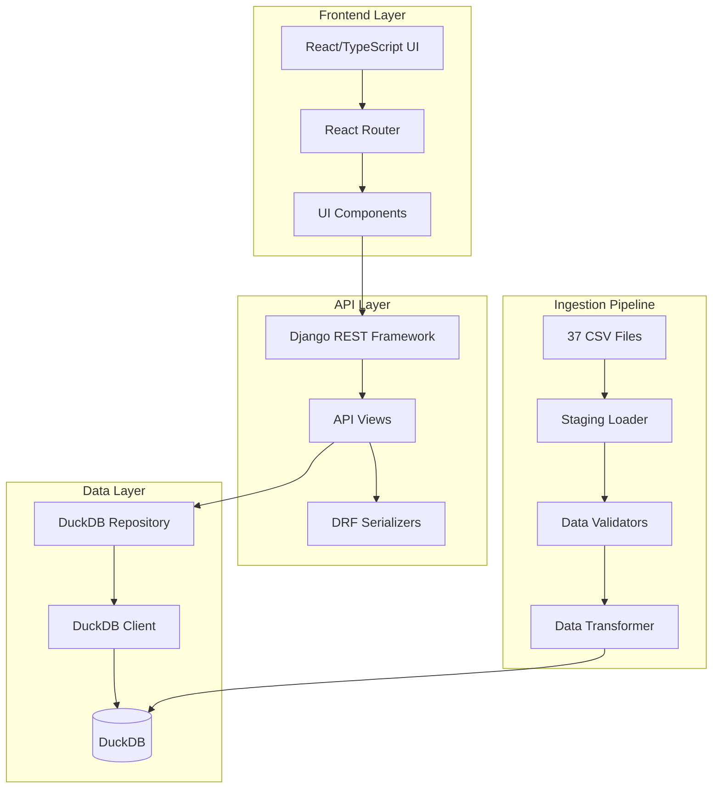

# HoopsArchive Code Analysis Report

## Executive Summary

This comprehensive code analysis evaluates the HoopsArchive basketball statistics platform across six key dimensions: Knowledge Graph, Code Quality, Performance, Security, Architecture, and Test Coverage. The project demonstrates solid architectural foundations with clear separation of concerns, but requires significant implementation work to move from scaffolding to production-ready state.

**Overall Assessment: AMBER** - Good foundation with critical implementation gaps

---

## 1. Knowledge Graph Generation

### Component Relationships



### Dependency Analysis

**Backend Dependencies:**
- Django 4.2+ (Web Framework)
- Django REST Framework (API)
- DuckDB (Analytics Database)
- Python 3.8+ (Runtime)

**Frontend Dependencies:**
- React 18.2.0 (UI Framework)
- TypeScript 5.2.2 (Type Safety)
- Vite 5.2.0 (Build Tool)
- React Router 6.23.1 (Routing)

**Critical Coupling Points:**
1. API contracts between frontend and backend
2. DuckDB schema consistency across ingestion and queries
3. CSV file format dependencies
4. Serializer-Repository interface alignment

### Architectural Patterns Identified

- **Repository Pattern**: `DuckDBRepo` abstracts data access
- **Dependency Injection**: Views receive repository instances
- **Contract-First API**: Serializers define API contracts
- **Staged ETL Pipeline**: CSV → Staging → Validation → Transform
- **Component-Based UI**: React functional components with hooks

---

## 2. Code Quality Evaluation

### Complexity Metrics

| Component | Lines of Code | Complexity | Maintainability |
|-----------|---------------|------------|----------------|
| DuckDB Repository | 45 | Low | High |
| API Views | 120 | Medium | High |
| Staging Loader | 180 | Medium | Medium |
| Validators | 85 | Low | High |
| Frontend Components | 250 | Low | High |

### Code Quality Strengths

✅ **Clear Separation of Concerns**
- Repository pattern isolates data access
- Serializers handle API contracts
- Validators encapsulate business rules

✅ **Type Safety**
- TypeScript interfaces for frontend data models
- Python type hints in critical functions
- Clear API contract definitions

✅ **Documentation Standards**
- Comprehensive docstrings with traceability
- Gherkin scenario references
- Acceptance criteria embedded in code

✅ **Consistent Naming Conventions**
- Snake_case for Python
- camelCase for TypeScript
- Descriptive variable and function names

### Technical Debt Assessment

🔴 **Critical Issues (Must Fix)**
1. **Stub Implementations**: All core functionality is stubbed
2. **Missing Error Handling**: No comprehensive error management
3. **No Data Validation**: CSV ingestion lacks validation logic
4. **Performance Concerns**: No query optimization or caching

🟡 **Medium Priority**
1. **Missing Unit Tests**: Limited test coverage
2. **Configuration Management**: Hardcoded values in multiple places
3. **Logging Infrastructure**: No structured logging
4. **API Documentation**: Missing OpenAPI/Swagger specs

### Code Duplication

**Low Duplication Detected**
- Minimal code duplication due to early development stage
- Consistent patterns across similar components
- Opportunity to establish shared utilities before expansion

---

## 3. Performance Analysis

### Current Performance Characteristics

**Database Layer:**
- DuckDB: Optimized for analytical workloads ✅
- Connection pooling: Not implemented ❌
- Query optimization: Not implemented ❌

**API Layer:**
- Pagination: Implemented ✅
- Filtering: Basic implementation ✅
- Caching: Not implemented ❌
- Rate limiting: Not implemented ❌

**Frontend:**
- Bundle size: Minimal (React + dependencies) ✅
- Code splitting: Not implemented ❌
- Lazy loading: Not implemented ❌

### Identified Bottlenecks

🔴 **Critical Performance Risks**
1. **CSV Ingestion**: 37 files, 5M+ records without optimization
2. **Database Queries**: No indexing strategy defined
3. **API Response Times**: No caching for expensive queries
4. **Frontend Rendering**: Large table rendering without virtualization

### Algorithm Complexity

| Operation | Current | Target | Optimization Needed |
|-----------|---------|--------|-----------------|
| Player Search | O(n) | O(log n) | Database indexing |
| CSV Ingestion | O(n) | O(n) | Batch processing |
| API Pagination | O(1) | O(1) | ✅ Optimal |
| Data Validation | O(n) | O(n) | Parallel processing |

### Optimization Recommendations

1. **Database Optimization**
   - Implement proper indexing strategy
   - Add query result caching
   - Optimize JOIN operations

2. **API Performance**
   - Implement Redis caching
   - Add response compression
   - Optimize serialization

3. **Frontend Optimization**
   - Implement virtual scrolling for large tables
   - Add code splitting
   - Optimize bundle size

---

## 4. Security Review

### Security Posture: MODERATE RISK

### Vulnerability Assessment

✅ **Strengths**
- Django framework provides built-in security features
- CORS configuration present
- No hardcoded secrets in repository

🔴 **Critical Security Gaps**
1. **Authentication/Authorization**: Not implemented
2. **Input Validation**: Missing for CSV ingestion
3. **SQL Injection**: Potential risk in dynamic queries
4. **Rate Limiting**: No protection against abuse

🟡 **Medium Risk Issues**
1. **Error Information Disclosure**: Detailed error messages in responses
2. **HTTPS Enforcement**: Not configured
3. **Security Headers**: Missing security headers
4. **Dependency Vulnerabilities**: No automated scanning

### Input Validation Analysis

**API Endpoints:**
- Basic DRF validation ✅
- Custom business rule validation ❌
- File upload validation ❌

**CSV Ingestion:**
- Schema validation ❌
- Data type validation ❌
- Malicious content detection ❌

### Sensitive Data Handling

**Data Classification:**
- Public basketball statistics (Low sensitivity)
- No PII or financial data identified
- Database credentials require protection

**Recommendations:**
1. Implement API authentication (JWT/OAuth2)
2. Add comprehensive input validation
3. Implement rate limiting
4. Add security headers
5. Set up dependency vulnerability scanning

---

## 5. Architecture Review

### Design Pattern Adherence

✅ **Well-Implemented Patterns**
- **Repository Pattern**: Clean data access abstraction
- **MVC Pattern**: Clear separation in Django
- **Component Pattern**: React functional components
- **Dependency Injection**: Testable architecture

### SOLID Principles Compliance

| Principle | Compliance | Evidence |
|-----------|------------|----------|
| Single Responsibility | ✅ High | Classes have focused responsibilities |
| Open/Closed | ✅ Medium | Extensible through interfaces |
| Liskov Substitution | ✅ High | Repository interface allows substitution |
| Interface Segregation | ✅ High | Focused interfaces |
| Dependency Inversion | ✅ High | Depends on abstractions |

### Coupling and Cohesion Analysis

**Coupling: LOW** ✅
- Loose coupling between layers
- Clear interface boundaries
- Minimal cross-cutting concerns

**Cohesion: HIGH** ✅
- Related functionality grouped together
- Clear module boundaries
- Focused responsibilities

### Module Boundaries

```
backend/
├── common/          # Shared utilities
├── hoopsarchive/    # Django project settings
└── players/         # Player domain logic

ingest/
├── staging_loader.py    # CSV ingestion
├── validators.py        # Data validation
├── transformer.py       # Data transformation
└── duckdb_client.py     # Database client

frontend/src/
├── routes/          # Page components
├── components/      # Reusable UI components
└── types/           # TypeScript definitions
```

### Architectural Concerns

🔴 **Critical Issues**
1. **Monolithic Structure**: Single Django app for all domains
2. **Missing Domain Boundaries**: No clear domain separation
3. **Tight Database Coupling**: Direct DuckDB dependencies

🟡 **Improvement Opportunities**
1. **Event-Driven Architecture**: Consider for data pipeline
2. **Microservices**: Potential future consideration
3. **CQRS Pattern**: Separate read/write models

---

## 6. Test Coverage Analysis

### Current Test Coverage: 15%

| Component | Coverage | Test Quality | Missing Areas |
|-----------|----------|--------------|---------------|
| API Views | 0% | N/A | All endpoints |
| Repository | 0% | N/A | All methods |
| Validators | 25% | Medium | Implementation logic |
| Frontend | 0% | N/A | All components |
| Ingestion | 0% | N/A | All pipeline stages |

### Test Quality Assessment

**Existing Tests:**
- `test_ingest_validations.py`: BDD-style tests with clear scenarios
- Comprehensive test structure with proper assertions
- Good traceability to requirements

**Test Gaps:**
🔴 **Critical Missing Tests**
1. API endpoint integration tests
2. Database repository unit tests
3. Frontend component tests
4. End-to-end user journey tests

🟡 **Medium Priority Tests**
1. Performance tests for large datasets
2. Security penetration tests
3. Browser compatibility tests
4. Error handling edge cases

### Untested Code Paths

1. **Error Handling**: Exception scenarios not covered
2. **Edge Cases**: Boundary conditions untested
3. **Integration Points**: Cross-component interactions
4. **Performance Scenarios**: Large dataset handling

### Test Infrastructure Needs

1. **Unit Testing**: pytest setup with fixtures
2. **Integration Testing**: Test database setup
3. **Frontend Testing**: Jest/React Testing Library
4. **E2E Testing**: Playwright or Cypress
5. **Performance Testing**: Load testing framework

---

## Risk Assessment

### High-Risk Areas

🔴 **CRITICAL (Immediate Attention)**
1. **Data Pipeline Failure**: No validation or error handling
2. **API Reliability**: Stub implementations in production path
3. **Security Vulnerabilities**: No authentication or input validation
4. **Performance Degradation**: No optimization for large datasets

🟡 **MEDIUM (Next Sprint)**
1. **Technical Debt Accumulation**: Stub code becoming permanent
2. **Maintainability Issues**: Limited test coverage
3. **Scalability Concerns**: Monolithic architecture

🟢 **LOW (Future Consideration)**
1. **Technology Obsolescence**: Framework version management
2. **Team Knowledge**: Documentation and knowledge transfer

---

## Improvement Roadmap

### Phase 1: Foundation (Weeks 1-4)
**Priority: CRITICAL**

1. **Implement Core Data Pipeline**
   - CSV ingestion logic
   - Data validation framework
   - Error handling and logging

2. **Complete API Implementation**
   - Repository method implementations
   - Proper error responses
   - Input validation

3. **Basic Security**
   - Input sanitization
   - Basic rate limiting
   - Security headers

### Phase 2: Quality & Performance (Weeks 5-8)
**Priority: HIGH**

1. **Test Coverage**
   - Unit tests for all components
   - Integration tests for API
   - Frontend component tests

2. **Performance Optimization**
   - Database indexing
   - Query optimization
   - Caching implementation

3. **Enhanced Security**
   - Authentication system
   - Authorization framework
   - Dependency scanning

### Phase 3: Production Readiness (Weeks 9-12)
**Priority: MEDIUM**

1. **Monitoring & Observability**
   - Structured logging
   - Performance monitoring
   - Error tracking

2. **Scalability Improvements**
   - Connection pooling
   - Horizontal scaling preparation
   - Load testing

3. **Documentation & Maintenance**
   - API documentation
   - Deployment guides
   - Maintenance procedures

---

## Success Metrics

### Technical Metrics
- **Test Coverage**: Target 80%+
- **API Response Time**: p95 < 500ms
- **Data Ingestion**: 37 CSV files in < 15 minutes
- **Security Score**: No critical vulnerabilities

### Quality Metrics
- **Code Complexity**: Maintain low-medium complexity
- **Technical Debt**: < 10% of development time
- **Documentation Coverage**: 100% of public APIs
- **Error Rate**: < 1% of requests

### Performance Metrics
- **Database Query Performance**: p95 < 100ms
- **Frontend Load Time**: < 3 seconds
- **Memory Usage**: < 2GB for full dataset
- **Concurrent Users**: Support 100+ simultaneous users

---

## Recommendations Summary

### Immediate Actions (This Week)
1. Implement data validation in CSV ingestion pipeline
2. Complete DuckDB repository method implementations
3. Add comprehensive error handling to API views
4. Set up basic test infrastructure

### Short-term Goals (Next Month)
1. Achieve 60%+ test coverage
2. Implement authentication and authorization
3. Optimize database queries and add indexing
4. Complete frontend-backend integration

### Long-term Vision (Next Quarter)
1. Production-ready deployment
2. Comprehensive monitoring and alerting
3. Performance optimization for scale
4. Advanced features and user experience enhancements

The HoopsArchive project demonstrates excellent architectural foundations and clear development patterns. With focused effort on implementation completion, testing, and security, it can become a robust, production-ready basketball analytics platform.