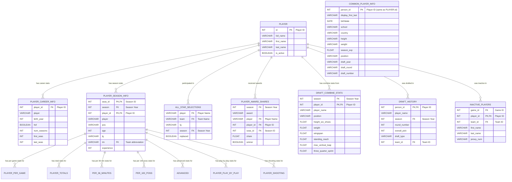
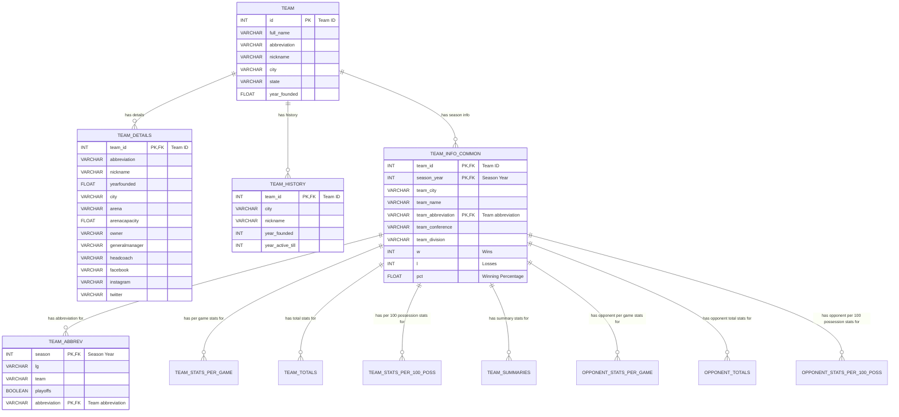
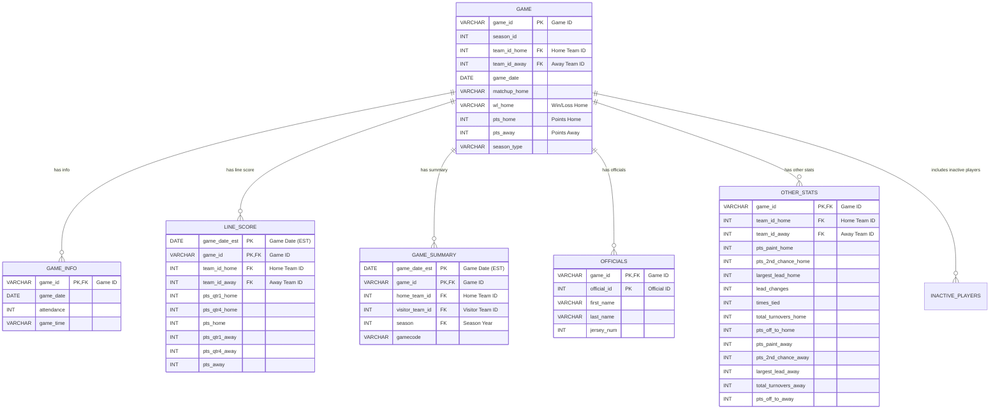
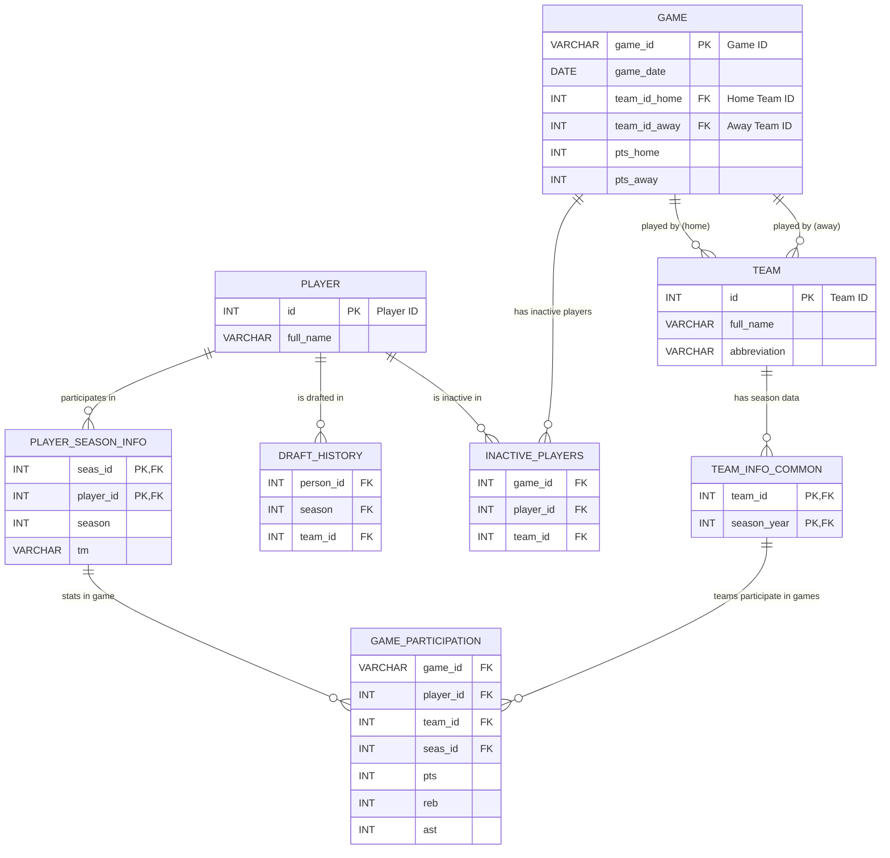

# BBClone CSV Data Models

This document outlines the conceptual data models derived from the provided CSV files, illustrating the relationships between various entities for the Basketball-Reference clone. The diagrams are presented using Mermaid syntax for clarity.

## 1. Player-centric Data Model

This diagram focuses on the `PLAYER` entity and its relationships with various data points, including biographical information, career and season statistics, awards, and draft details.

**Explanation:**
The central entity is `PLAYER` (from `player.csv`), identified by `id`. `COMMON_PLAYER_INFO` provides extended biographical data, linked via `person_id` (assumed equivalent to `player.id`). Statistical data is organized around `PLAYER_SEASON_INFO` (linking `seas_id` and `player_id`), acting as a bridge to detailed season-level performance tables like `PLAYER_PER_GAME`, `PLAYER_TOTALS`, and `ADVANCED`. Draft and award information (`DRAFT_HISTORY`, `ALL_STAR_SELECTIONS`, `PLAYER_AWARD_SHARES`, `DRAFT_COMBINE_STATS`) are linked directly or indirectly to the `PLAYER` and `SEASON` entities. `INACTIVE_PLAYERS` connects players to specific games where they were inactive.

## 2. Team-centric Data Model

This diagram illustrates the relationships around the `TEAM` entity, including detailed information, historical data, and various team and opponent statistics.

**Explanation:**
The `TEAM` entity (`team.csv`) is the primary focus, identified by `id`. `TEAM_DETAILS` and `TEAM_HISTORY` enrich this with current and historical information. `TEAM_INFO_COMMON` is a critical junction, associating `TEAM` data with specific `SEASON`s and providing high-level performance metrics. This table acts as a hub for various statistical views (`TEAM_STATS_PER_GAME`, `TEAM_TOTALS`, `OPPONENT_STATS_PER_GAME`, etc.), allowing for detailed seasonal analysis of both a team's performance and its opponents'.

## 3. Game-centric Data Model

This diagram outlines the structure of game-related information, showing how different CSVs contribute to a complete picture of an individual game.

**Explanation:**
The `GAME` entity (`game.csv`) serves as the central point for all game-related data, uniquely identified by `game_id`. It includes core details like participating teams and final scores, with foreign keys linking to the `TEAM` entity. Auxiliary tables such as `GAME_INFO`, `LINE_SCORE`, `GAME_SUMMARY`, `OFFICIALS`, and `OTHER_STATS` provide additional context and granular details for each game, all connected through the `game_id`. `INACTIVE_PLAYERS` also bridges to the `GAME` entity.

## 4. Overall Conceptual Data Model

This unified diagram provides a high-level overview of how the primary entities—`PLAYER`, `TEAM`, and `GAME`—interact within the BBClone data structure.

**Explanation:**
This diagram demonstrates the core relationships:
*   **Players and Seasons:** Players are linked to their seasonal statistics through `PLAYER_SEASON_INFO`.
*   **Players and Draft/Inactivity:** Players have direct relationships to their draft history (`DRAFT_HISTORY`) and to game where they were inactive (`INACTIVE_PLAYERS`).
*   **Teams and Seasons:** Teams are linked to their seasonal information and statistics via `TEAM_INFO_COMMON`.
*   **Games, Players, and Teams:** Games are central, connecting to two teams (home and away). The conceptual `GAME_PARTICIPATION` links player and team seasonal data to individual game events.